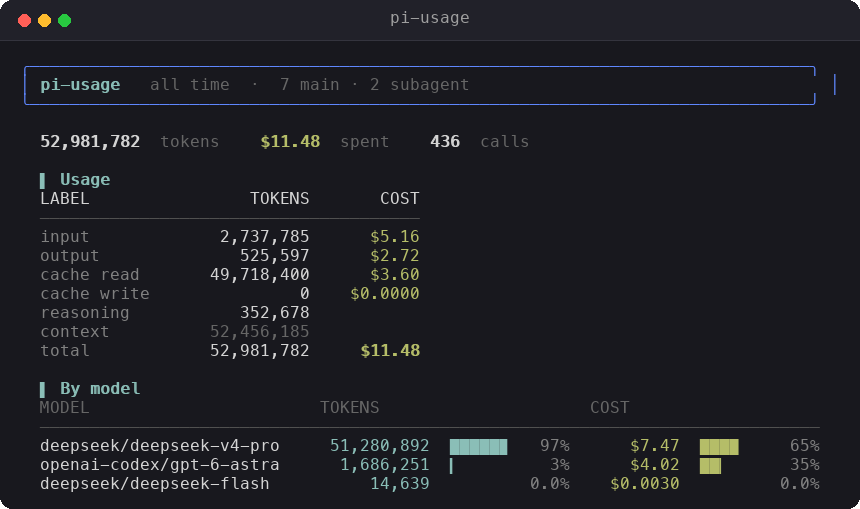

# pi-usage

Token, context, and cost usage dashboard for the [pi coding agent](https://github.com/earendil-works/pi-mono). Two ways to use it:

- **`/usage`** — an interactive, theme-aware TUI dashboard inside pi.
- **`pi-usage`** — a standalone zero-dependency CLI (works anywhere Node runs).

Both read the same session data and always agree.



## Install

### As a pi package (recommended)

```bash
pi install npm:pi-usage-cli         # from npm
pi install git:github.com/sumit1612/pi-usage  # from git
pi install /path/to/pi-usage            # local directory
```

This loads the `/usage` slash command automatically. Then type `/usage` in pi.

### As a standalone CLI

```bash
npm install -g pi-usage-cli
pi-usage            # overview
pi-usage models     # per-model table
```

## CLI usage

```
pi-usage [view] [flags]

VIEWS
  overview   totals + by-model tokens & cost   (default)
  models     per-model table
  days       per-day table + bars
  sessions   per-session table

FLAGS
  --since <n>     last N days (default 30)
  --all           include all time
  --model <str>   filter by model substring
  --provider <str> filter by provider substring
  --limit <n>     max rows in tables (default 15)
  --dir <path>    custom session directory
  --color         force color even when piped
  --plain         flat output (no color / unicode)
  --json          machine-readable output
  -h, --help      show help
```

Colors match pi's built-in **dark** theme. Output is auto-detected: rich (color + unicode) on a TTY, clean flat tables when piped.

## `/usage` keys

| Key | Action |
|---|---|
| `←` / `→` | cycle views |
| `1`–`4` | jump to a view |
| `↑` / `↓` | scroll lists |
| `r` | refresh data |
| `esc` / `q` | close |

Flags are passed through: `/usage models`, `/usage --all`, `/usage --since 7`, `/usage --model gpt`.

## Metrics

| Field | Meaning |
|---|---|
| input / output / cache read / cache write / reasoning | token breakdown |
| context | `input + cacheRead + cacheWrite` — tokens resident in the request |
| total | billable tokens |
| cost | $ per component + total |

## How it counts

Only `assistant`, `compaction`, and `branch_summary` usage is counted. Tool results — which can embed a *summary* of subagent usage — are skipped to avoid double-counting; subagent turns are read from their own session files instead.

## Structure

```
lib/core.js        shared aggregation engine (no dependencies)
bin/pi-usage       CLI (presentation only)
extensions/usage.ts  /usage slash command (interactive TUI)
```

## Publishing

```bash
npm publish
# or push to GitHub and: pi install git:github.com/sumit1612/pi-usage
```

Tag with `pi-package` (already in `package.json`) to appear in the [package gallery](https://pi.dev/packages).

## License

MIT
